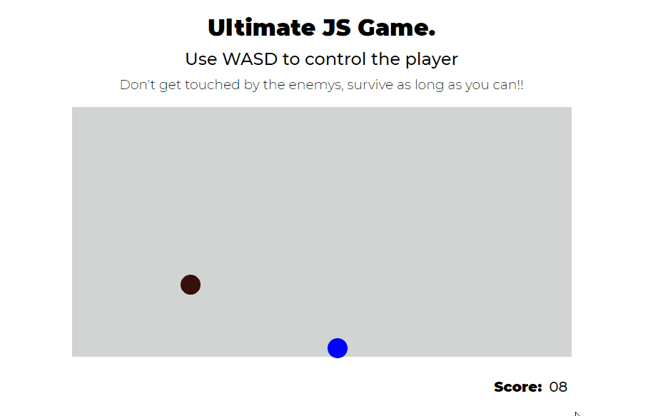

# Ultimate Javascript Game

A simple game made without any library, just javascript, to perfect my skills and fundamentals

To play open http://nyfts.github.io/  
Use WASD to control the player (blue circle)  
Avoid the enemys (circles of red tones)  
Catch the powerups (green circles)  

## Scoreboard

There is a simple API developed in .net core for the score system, named ScoreJs.API, located in https://github.com/Nyfts/ScoreJs.API.
It is not running on any server at the moment, so there is no score: /
